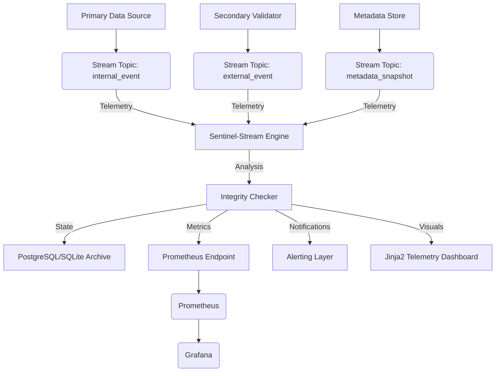

---

# Sentinel-Stream: Distributed Data Integrity & Reconciliation Engine

**A high-concurrency framework for real-time synchronization and anomaly detection across heterogeneous data sources.**

[](https://github.com/chaitanyadav69/SignalRecon-AI)

---

## 🧠 Engineering Challenge

In distributed architectures, multiple microservices (Internal Engines, External Validations, and Persistence Layers) log the same transaction asynchronously. This leads to **data drift** caused by:

- Network Latency & Jitter
- Clock Skew across distributed nodes
- Partial Data Corruption in transit

**Sentinel-Stream** is engineered to detect, flag, and resolve these discrepancies in real-time using a streaming-first approach.

---

## 🎯 System Objectives

- **Multi-Source Synchronization:** Reconciling event streams from $N$ disparate systems.
- **Anomaly Detection:** Real-time flagging of structural and value-based mismatches.
- **Observability:** Exporting system health and reconciliation metrics to Prometheus/Grafana.
- **Persistence & Auditability:** Maintaining a cryptographically-verifiable record of all reconciliation outcomes.

---

## 🔁 System Architecture




---

## 📏 Integrity Validation Logic

The engine applies a multi-stage validation gate for every unique Event ID:

- ✅ **Dimensional Integrity:** Exact match of quantitative fields across $N$ sources.
- ✅ **Precision Tolerance:** Numerical values must align within a configurable $\epsilon$ (e.g., $\epsilon \leq 0.005$).
- ✅ **Temporal Alignment:** Handles clock-skew with a drift tolerance window (e.g., $\Delta t \leq 100ms$).
- ✅ **Relational Consistency:** $$\text{Residual} = |(\text{Value} \times \text{Units}) - \text{Offset} - \text{Total}| < 1.0$$

---

## 🧰 Technical Stack

| Layer | Technology | Role |
| :--- | :--- | :--- |
| **Transport** | Apache Kafka | Event-driven ingestion & message queuing |
| **Core Logic** | Python (Asynchronous) | Multi-threaded reconciliation processing |
| **Storage** | SQLAlchemy + SQLite | Relational persistence & audit trail |
| **Monitoring** | Prometheus / Grafana | System telemetry & visualization |
| **Orchestration** | Docker / Docker Compose | Containerized deployment |

---

## 🚀 Deployment

**Prerequisites:** Docker & Docker Compose.

```bash
# 1. Clone & Initialize
git clone https://github.com/chaitanyadav69/SignalRecon-AI.git
cd SignalRecon-AI

# 2. Spin up Infrastructure (Kafka, Prometheus, Grafana)
docker-compose up --build -d

# 3. Initialize Data Ingestion
docker exec -it sentinel_app python kafka/producer.py
```

### Dashboard Access:
- **Telemetry UI:** `http://localhost:5000/`
- **System Metrics (Grafana):** `http://localhost:3000/` (Admin/Admin)

---

## 🧪 Future Research Roadmap

- **Hypothesis-based Fuzzing:** Automated generation of malformed packets to test system edge-cases.
- **Airflow DAG Integration:** Transitioning to hybrid Real-time/Batch processing for end-of-day auditing.
- **Probabilistic Scoring:** Implementing ML-based anomaly detection to score suspicious patterns before reconciliation.

---
